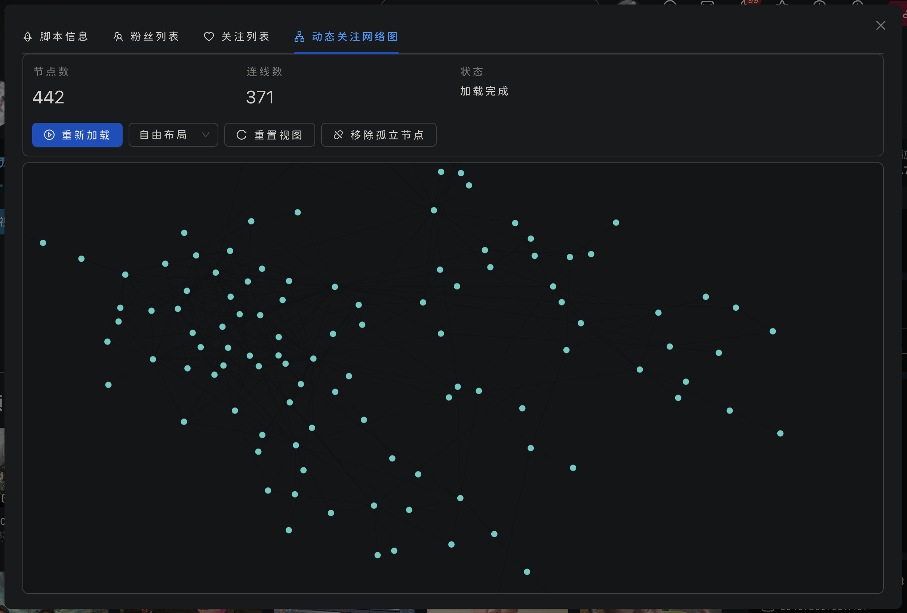

# Bilibili React Helper

<p align="center">
  <strong>基于 React + TypeScript + Ant Design 构建的哔哩哔哩增强脚本</strong>
</p>

<p align="center">
  
  
  
  
  
</p>

## 项目简介

这是一个现代化的油猴脚本（Userscript）项目，使用 React 18 框架和 Ant Design 5 组件库构建。脚本为哔哩哔哩网站提供了增强功能，帮助用户更好地管理和可视化社交关系。

### 核心特性

- 粉丝列表查看 - 分页浏览粉丝，查看详细信息和关注关系
- 关注列表管理 - 查看关注用户，支持展开共同关注
- 关注网络图 - 交互式可视化关注关系网络
- 现代化 UI - 基于 Ant Design 5 的专业界面
- 响应式设计 - 适配不同屏幕尺寸
- 智能缓存 - LocalStorage 缓存，减少 API 调用
- 性能优化 - 批量加载，分页处理，流畅体验

## 重要声明

**本项目仅供学习和研究使用，请勿用于任何商业用途或违反相关服务条款的行为。**

### 数据获取说明

- **所有数据均为公开数据**：本脚本获取的所有数据（粉丝列表、关注列表等）都是可以通过手动点击用户主页的"关注者"、"粉丝"等标签页获取的公开信息。
- **无特殊权限请求**：脚本不会获取任何需要特殊权限才能访问的私密数据。
- **合规性**：脚本仅使用 Bilibili 官方公开的 API 接口，不涉及任何越权操作或数据爬取。

### 使用限制

- 本项目代码仅供个人学习、研究和技术交流使用
- 请遵守 Bilibili 的用户协议和服务条款
- 请勿用于任何可能侵犯他人隐私或违反法律法规的行为
- 使用本脚本所产生的任何后果由使用者自行承担

---

## 功能预览



## 主要功能

### 粉丝列表
- 分页加载粉丝列表（每页 20 条）
- 显示用户头像、昵称、签名
- 认证状态、大会员标识

### 关注列表
- 分页浏览关注用户
- **共同关注展开** - 点击展开查看与该用户的共同关注
- 共同关注数量统计

### 关注网络图
- **交互式网络可视化** - 基于 force graph 渲染
- **鼠标交互**
  - 悬停：显示用户名 + 高亮邻接节点
  - 点击：跳转用户空间

## 技术栈

- **React 18** - 现代化的 UI 框架
- **TypeScript** - 类型安全的 JavaScript 超集
- **Ant Design 5** - 企业级 UI 组件库
- **Webpack 5** - 模块打包工具
- **Cosmograph** - 图形可视化库
- **Less** - CSS 预处理器

## 开发环境要求

- Node.js 20+
- pnpm (推荐) / npm / yarn

## 安装与使用

### 方式一：直接安装（推荐用户）

1. **安装油猴扩展**
   - Chrome/Edge: [Tampermonkey](https://chrome.google.com/webstore/detail/tampermonkey/dhdgffkkebhmkfjojejmpbldmpobfkfo)

2. **安装脚本**
   - [安装](https://raw.githubusercontent.com/irisWirisW/BilibiliRelationMap/master/script.user.js)

3. **使用脚本**
   - 访问用户自己的[空间页面](https://space.bilibili.com)
   - 点击页面右下角的浮动按钮
   - 在弹出的窗口中选择功能标签页

### 方式二：开发调试

#### 1. 克隆项目

```bash
git clone https://github.com/irisWirisW/BilibiliRelationMap.git
cd BilibiliRelationMap
```

#### 2. 安装依赖

```bash
pnpm install
```

#### 3. 构建生产版本

```bash
# 普通构建（不更新版本号）
pnpm build

# 构建并递增 patch 版本号（0.0.x）
pnpm build:patch

# 构建并递增 minor 版本号（0.x.0）
pnpm build:minor
```

**版本号说明：**
- `build:patch` - 递增修订版本号，例如 1.0.0 → 1.0.1（用于 bug 修复）
- `build:minor` - 递增次版本号并重置修订号，例如 1.0.5 → 1.1.0（用于新功能）
- 版本号会同步更新到 `package.json` 和 `src/metadata.json`

## 开发说明

### 构建流程

项目使用 **Webpack 5** 打包，配置文件为 `webpack.config.cjs`。构建过程：

1. **编译 TypeScript** - 使用 ts-loader 编译 TS/TSX 代码
2. **处理样式** - 处理 Less/CSS 文件并内联到 JS
3. **单文件打包** - 将所有依赖（React、Ant Design等）打包到单个文件
4. **添加元数据** - 自动添加油猴脚本头部信息（来自 `src/metadata.json`）
5. **代码压缩** - 使用 Terser 最小化代码，保留脚本注释

### 脚本元数据

脚本的元数据配置在 `src/metadata.json` 中：

```json
{
  "name": "Bilibili React Helper",
  "version": "0.4.7",
  "description": "基于 React + TypeScript + Ant Design 的哔哩哔哩增强脚本",
  "author": "1ris_W",
  "match": "*://*.bilibili.com/*",
  "grant": ["GM_xmlhttpRequest", "GM_cookie"],
  "run-at": "document-end"
}
```

## 主要依赖

### 运行时依赖

| 依赖 | 版本 | 用途 |
|------|------|------|
| `react` | ^18.2.0 | UI 框架 |
| `react-dom` | ^18.2.0 | React DOM 渲染 |
| `antd` | ^5.12.5 | UI 组件库 |
| `@ant-design/icons` | ^6.1.0 | 图标库 |
| `d3-force` | ^3.0.0 | 力导向图算法 |
| `force-graph` | ^1.43.5 | 图形可视化库 |
| `idb` | ^8.0.3 | IndexedDB 封装库 |

### 开发依赖

| 依赖 | 版本 | 用途 |
|------|------|------|
| `typescript` | ^5.3.3 | TypeScript 编译器 |
| `webpack` | ^5.89.0 | 模块打包工具 |
| `webpack-cli` | ^5.1.4 | Webpack 命令行工具 |
| `webpack-bundle-analyzer` | ^5.0.1 | 打包分析工具 |
| `ts-loader` | ^9.5.1 | TypeScript 加载器 |
| `@babel/core` | ^7.28.5 | Babel 核心 |
| `@babel/preset-react` | ^7.28.5 | Babel React 预设 |
| `@babel/preset-typescript` | ^7.28.5 | Babel TypeScript 预设 |
| `babel-loader` | ^10.0.0 | Babel 加载器 |
| `babel-plugin-import` | ^1.13.8 | 按需加载插件 |
| `less` | ^4.2.0 | CSS 预处理器 |
| `less-loader` | ^11.1.3 | Less 加载器 |
| `css-loader` | ^6.8.1 | CSS 加载器 |
| `style-loader` | ^3.3.3 | 样式注入器 |
| `@types/react` | ^18.2.45 | React 类型定义 |
| `@types/react-dom` | ^18.2.18 | React DOM 类型定义 |
| `@types/d3-force` | ^3.0.10 | D3 Force 类型定义 |
| `@types/node` | ^24.10.1 | Node.js 类型定义 |
| `@types/webpack` | ^5.28.5 | Webpack 类型定义 |
| `@types/tampermonkey` | ^5.0.3 | Tampermonkey 类型定义 |

## 常见问题

<details>
<summary><strong>Q: 脚本为什么无法加载？</strong></summary>

A: 请检查：
1. 是否已安装 Tampermonkey/Greasemonkey 扩展
2. 是否在哔哩哔哩用户[空间页面](https://space.bilibili.com)
3. 扩展是否启用该脚本
4. 浏览器控制台是否有报错信息
</details>

<details>
<summary><strong>Q: 关注网络图加载很慢？</strong></summary>

A:
- 关注数量较多时需要加载时间，属于正常现象
- 脚本会显示加载进度
- 已加载的共同关注数据会缓存 30 天
- 建议使用调试面板调整参数优化显示效果
</details>

<details>
<summary><strong>Q: 如何贡献代码？</strong></summary>

A:
1. Fork 本仓库
2. 创建特性分支 (`git checkout -b feature/AmazingFeature`)
3. 提交更改 (`git commit -m 'Add some AmazingFeature'`)
4. 推送到分支 (`git push origin feature/AmazingFeature`)
5. 提交 Pull Request
</details>

<details>
<summary><strong>Q: 构建失败怎么办？</strong></summary>

A:
1. 确保 Node.js 版本 >= 20
2. 删除 `node_modules` 和 `dist` 文件夹
3. 重新安装依赖：`pnpm install`
4. 运行类型检查：`pnpm type-check`
5. 重新构建：`pnpm build`
</details>

## Roadmap

- [ ] 支持导出数据（JSON、CSV 格式）
- [ ] 优化大数据量加载性能
- [ ] 添加暗黑模式支持
- [ ] 多语言支持（英文）

## 致谢

- [Bilibili-Evolved](https://github.com/the1812/Bilibili-Evolved) - 构建方案参考
- [Ant Design](https://ant.design/) - UI 组件库
- [React](https://react.dev/) - UI 框架

## Star History

如果这个项目对你有帮助，欢迎给个 Star

[](https://www.star-history.com/#irisWirisW/BilibiliRelationMap&type=date&legend=top-left)
